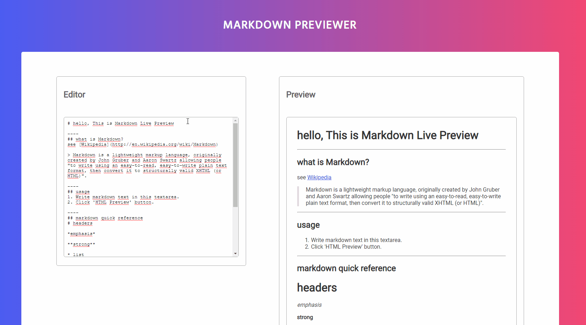

# Markdown Previewer

## Built a Markdown Live Previewer with marked.js

In this project I used a mix of HTML, JavaScript, CSS and React.



## Install

Make you sure you have installed Node (if not, you can download it from [here](https://nodejs.org/en/download/)).

Clone the repo to your computer and install dependencies:
```
$ git clone https://github.com/jsgilberto/Markdown-Previewer.git
$ cd Markdown-Previewer
$ npm install
```

## Usage

Once you have the repo in your local computer, go into the repo and run the following command:
```
$ npm start
```
It will open a window in your browser and you are ready to go!